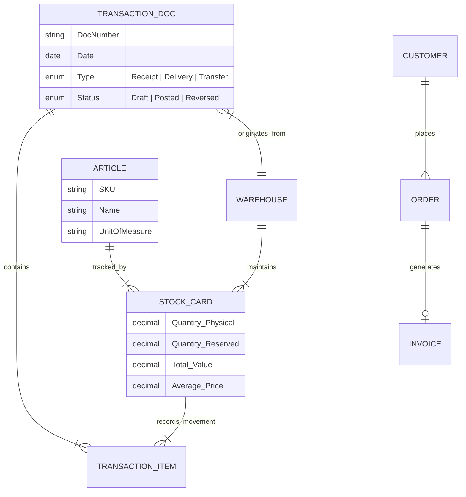

  
  
    

  <h1>Enterprise Resource Planning (ERP): Sales & Supply Chain Engine</h1>
  <h3>Integrated Business Process Management Solution</h3>

  

    
    
    
  

  

    <strong>A robust enterprise system connecting Order-to-Cash (O2C) and Procure-to-Pay (P2P) workflows.</strong>
     
    Engineered to handle complex document lifecycles, temporal pricing logic, and strictly consistent inventory auditing.
  

---

## System Overview

This application serves as the central nervous system for a trading enterprise. It bridges the gap between the **Sales Department** (Commercial) and the **Warehouse** (Logistics), ensuring that financial documents perfectly match physical inventory reality.

The core engineering challenge was to implement strict **Business Rules** that prevent data inconsistency during concurrent user operations (e.g., creating invoices while stock is moving).

---

## Domain Model & Database Schema

The system relies on a **Highly Normalized Relational Model**. The architecture explicitly defines relationships between Articles, Warehouses, and their dynamic states via Stock Cards.

---

## Module 1: Sales Subsystem (Commercial)

Designed for the **Sales Representative** persona, this module handles the commercial lifecycle with a focus on flexibility and financial accuracy.

### 🔹 Workflow Flexibility
*   **Order-to-Invoice:** Sales Reps can input a **Customer Order (Narudžbenica)**. Upon approval, the system can auto-generate a generic **Invoice** inheriting all line items.
*   **Direct Invoicing:** Supports ad-hoc sales where no prior order exists (Direct Entry).

### 🔹 Financial Computation Engine
*   **Temporal Pricing Logic:** The system manages **Price Lists (Cenovnici)**. When creating an invoice, the engine resolves the Item Price and VAT Rate based on the **Invoice Date** (not necessarily the current date), ensuring historical accuracy.
*   **Granular Calculation:**
    *   Calculates VAT (PDV) and Base Amount per **Line Item**.
    *   Aggregates totals at the **Document Header** level.

### 🔹 Output & Reporting
*   **Customer Invoice:** Generates a professional PDF with all line items for external distribution.
*   **Sales Ledger (KIF - Knjiga izlaznih faktura):** A mandatory fiscal report aggregating all issued invoices within a user-defined date range.

---

## Module 2: Warehouse Management (WMS)

Designed for the **Warehouse Manager**, acting as the "Source of Truth" for physical goods.

### 🔹 Transaction Management
The system supports full lifecycle management for three distinct document types:
1.  **Goods Receipt (Primka):** Increases stock value/quantity.
2.  **Delivery Note (Otpremnica):** Decreases stock value/quantity.
3.  **Inter-Warehouse Transfer (Međumagacinski promet):** Atomically moves stock between locations (Credit Origin / Debit Destination).

### 🔹 Lifecycle & State Machine
*   **Draft:** Editable state. No impact on the ledger.
*   **Posted (Knjižen):** Finalized state. Updates the **Stock Card** permanently.
*   **Reversed (Stornirano):** Corrective mechanism. Instead of deleting records (which destroys audit trails), the system creates a "Storno" effect to nullify the financial impact while keeping the history.

### 🔹 Initialization
*   **Opening Balance (Početno Stanje):** Specialized functionality to initialize Stock Cards at the beginning of a fiscal year.

---

## Module 3: Cross-Module Integration (The "Glue")

This is the most technically complex part of the system, ensuring synchronization between Sales and Warehouse.

### The Reservation Protocol (Crucial Logic)
To prevent "Overselling," the system enforces strict checks during the Invoice creation process:

1.  **Real-Time Availability Check:**
    *   When a Sales Rep enters an item, the system queries the specific **Stock Card** (Article + Warehouse combo).
    *   *Logic:* If `Requested > (Physical - Reserved)`, the system **warns the user** and blocks the line item.

2.  **Dynamic Reservation Updates (CUD Hooks):**
    *   The attribute `ReservedQuantity` on the Stock Card is automatically updated via event listeners on:
        *   **Create:** Adding an item increments reservation.
        *   **Update:** Changing quantity adjusts the reservation delta.
        *   **Delete:** Removing an item releases the reservation.

3.  **Automated Document Chaining:**
    *   Once an Invoice is finalized, the system can automatically generate a corresponding **Delivery Note (Otpremnica)**, carrying over all data to the warehouse team.

---

## Analytics & Reporting Intelligence

The system provides deep insights into inventory health and financial standing.

| Report Type | Description | Technical Implementation |
| :--- | :--- | :--- |
| **Stock List (Lager Lista)** | Shows current Quantity and Total Value for all items in a warehouse. | Aggregates data from active Stock Cards. |
| **Stock Card Analytics (Magacinska Kartica)** | A detailed chronological ledger of every movement. | Reconstructs history: *Opening + Inputs - Outputs = Balance*. |

---

## Tech Stack

*   **Platform:** Mendix Studio Pro (Model-Driven Engineering)
*   **Database:** Relational SQL Schema (3NF)
*   **Logic:** Event-driven Microflows for reservation handling.
*   **Reporting:** OQL (Object Query Language) for complex datasets.

## Compliance Note
> *The system is designed to uphold ACID (Atomicity, Consistency, Isolation, Durability) properties. Critical financial data is protected against partial updates, ensuring the ledger is always balanced.*
